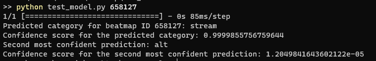

# osu!oracle

osu!oracle is beatmap classifier that takes in an given osu! beatmap and categorizes it into an existing genre such as aim, streams, speed, tech, etc. 


## Overview
### [Link to Google Colab](https://colab.research.google.com/drive/1vVEpzWpSfArfHxL41sSdiXFtE-0U22HN?usp=sharing) 


> Model is currently trained on collections from [osu!collector](https://osucollector.com/) where the beatmaps are mostly from tournament pools and range from `~ 5.1☆` to `~ 8.5☆` range.

> Current categories are `aim, alt, tech, and streams` with hopefully more to come


## Requirements
```
- Python 3
- tensorflow
- keras
- numpy
- scikit-learn
```
## Getting Started

### Running on Colab (Highly Recommended)

1. Simply open the Google Colab link, run the setup and you're good to go

### Running Locally (outdated, contact me if you still want to try)

1. Download the model from the Google Drive link above
2. Open the directory in a terminal 
	- Make sure you have all the requirements installed. If you don't, run the following command: `pip install <w/e>`
3. Run the following script to test the current iteration of the model:
```
python test_model.py <beatmap_id>
```
> ex. to test Blue Zenith's top diff, take the last sequence of digits (the beatmap_id) https://osu.ppy.sh/beatmapsets/292301#osu/658127 and run the following command:
```
python test_model.py 658127
```

4. Output should look something like this:


## Known Issues
- The model performance drops significantly when working outside its trained data range of 5☆ to 8☆ maps
- Aim maps over 300 second in length occasionally leans towards tech for some reason
- Maps that have both aim and stream componenets are occasionaly misclassified
- Gamemodes other than standard are currently not supported and will probably break

## Licenses
This project uses the following projects:
- [ProcessMemoryDataFinder](https://github.com/Piotrekol/ProcessMemoryDataFinder), [licensed under GPL-3.0](https://github.com/Piotrekol/ProcessMemoryDataFinder/blob/master/LICENSE)
