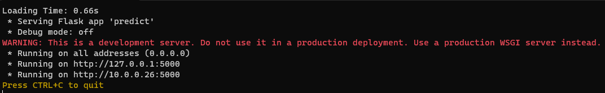

# osu!oracle

osu!oracle is beatmap classifier that takes in an osu! beatmap and categorizes it into an existing genre such as aim, streams, alt, tech, etc. 


## Overview
### [Link to Google Colab](https://colab.research.google.com/drive/1vVEpzWpSfArfHxL41sSdiXFtE-0U22HN?usp=sharing) 


> Model is currently trained on collections or tourney pools from [osu!collector](https://osucollector.com/).
>
>Beatmaps range from `~ 5.1☆` to `~ 8.8☆` range

> Current categories are `aim, alt, tech, and streams` with hopefully more to come

## Requirements
```
- Python 3.10
- .NET 5.0 (for concurrent client testing)
- gdown
- Keras
- numpy
- tensorflow
- h5py
- requests
- scikit-learn
- matplotlib
- joblib
```
## Getting Started

### Running on Colab (highly recommended!!)

1. Simply open the Google Colab link, follow the instructions and you're good to go

### Running alongside osu! client (good for testing! <3) 

1. Download the osu!oracle.zip file in the most recent release
2. Make sure to install the requirements through `pip install -r requirements.txt`
3. Run the executable file and launch osu before or after
4. A terminal should pop up and you should see something like this:

5. When you change songs in the song select screen, the terminal should update with the new prediction:


### Running Locally (outdated, probably won't work unless you tinker)

1. Download the model from the Google Drive link above
2. Open the directory in a terminal 
	- Make sure you have all the requirements installed. If you don't, run the following command: `pip install <w/e>`
3. Run the following script to test the current iteration of the model:
```
python test_model.py <beatmap_id>
```
> ex. to test Blue Zenith's top diff, take the last sequence of digits (the beatmap_id) https://osu.ppy.sh/beatmapsets/292301#osu/658127 and run the following command:
```
python test_model.py 658127
```

4. Output should look something like this:


## Training

first time working with machine learning so i won't go into detail since everything is very scuffed. the `osu_parser.py` and `model.py` files are the two important scripts. also take a look at the `model` section within the Colab.


if you're still intrested in training, message me on discord (token#8233) and i'll be happy to help you out :^)


## Known Issues
- Model performance drops significantly when working outside its trained data range of 5☆ to 9☆ maps
- Improperly classified maps during training will continue to be misclassified
	- (ex. [Top of the "M" top diff](https://osu.ppy.sh/beatmapsets/1302388#osu/2701095) where i accidently categorized it as `alt` instead of `aim`)
- Gamemodes other than standard are currently not supported and will (probably) break

please contact me if you notice any other issues or have any suggestions :^)

## Credit
This project uses the following projects:
- [CollectionManager](https://github.com/Piotrekol/CollectionManager) for organizing training collections
- [osu!collector](https://osucollector.com/) for beatmap training data
- [ProcessMemoryDataFinder](https://github.com/Piotrekol/ProcessMemoryDataFinder), [licensed under GPL-3.0](https://github.com/Piotrekol/ProcessMemoryDataFinder/blob/master/LICENSE)
- [OsuMemoryDataProvider](https://github.com/Piotrekol/ProcessMemoryDataFinder), [licensed under GPL-3.0](https://github.com/Piotrekol/ProcessMemoryDataFinder/blob/master/LICENSE)

